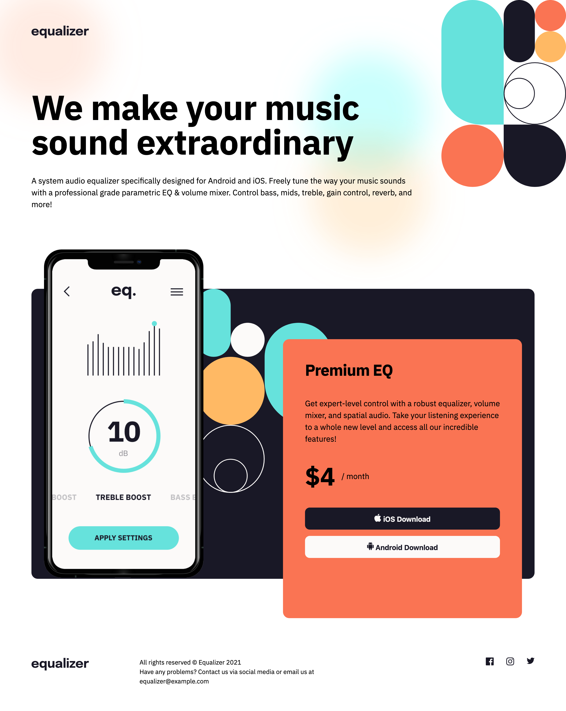

# Frontend Mentor - Equalizer landing page solution

This is a solution to the [Equalizer landing page challenge on Frontend Mentor](https://www.frontendmentor.io/challenges/equalizer-landing-page-7VJ4gp3DE). Frontend Mentor challenges help you improve your coding skills by building realistic projects.

## Table of contents

- [Overview](#overview)
  - [The challenge](#the-challenge)
  - [Screenshot](#screenshot)
  - [Links](#links)
- [My process](#my-process)
  - [Built with](#built-with)
  - [What I learned](#what-i-learned)
- [Author](#author)

## Overview

### The challenge

Users should be able to:

- View the optimal layout depending on their device's screen size
- See hover states for interactive elements

### Screenshot

### Links

- Solution URL: [https://github.com/LukasT1/fm-easy-equalizer-landing-page]
- Live Site URL: [https://lukast1.github.io/fm-easy-equalizer-landing-page/]

## My process

### Built with

- Semantic HTML5 markup
- CSS custom properties
- SCSS
- Flexbox
- CSS Grid
- Desktop-first workflow

### What I learned

Turned out to be relatively easy and I tackled this quite quickly. The biggest challenge for me was again positioning the images, especially in the main part. But with help of CSS grid it turned out to be quite easy.

## Author

- Frontend Mentor - [@youruhttps://www.frontendmentor.io/profile/LukasT1sername]
